# Syncing external timesheet solutions with Runn

In a budget-constrained environment, timesheets are a critical measurement of
how much time has been spent. Knowing this means that Runn can forecast when a
project will be completed, how much it is going to cost to deliver it and what
the total bill will be.
 
Runn calculates forecasts using two key ingredients:

- **Scheduled Work**: the hours that have been assigned to people in Runn.
- **Actual Work**: the actual hours that people have recorded in their timesheet.
 
Runn can still forecast without Actual Work, we do this by assuming that all
the Scheduled Work was done exactly as planned. However, the forecast will be
far more accurate when Actual Work hours are available.
 
There are 4 options for recording your Actual Work hours in Runn:
 
- You can enter them directly into Runn [using our built-in timesheet
    tools](https://help.runn.io/en/articles/3777293-timesheets-and-actuals-tracking).
- You can import them into Runn [using our CSV
    importer](https://help.runn.io/en/articles/4577789-importing-time-data-via-csv).
- You can [use one of our pre-built integrations (WorkflowMax, Clockifly & Harvest)](https://help.runn.io/en/articles/4398475-runn-integrations-overview).
- You can [use Runn’s API](https://app.runn.io/developer) to automate the syncing of data from your existing
  time tracking tool.
 
In this article, we will be discussing how to use Runn's API. The key benefits
of this approach are:
 
1. **No change management**. If your team is already using a timesheeting tool,
   having to move everyone over to a new tool could be painful. By syncing data
   using our API, your team can keep using the tools they are used to.
2. **Streamlined operations**. Timesheeting tools often manage a similar set of
   data to Runn: such as people, projects, clients, hours worked, etc.
   Integrating your tools with Runn keeps that data connected and in sync.
3. **Easier migrations**. Even if you plan to fully migrate to Runn’s
   timesheeting solution in the future, by keeping the two tools in sync, you
   can take your time running both in tandem till you are ready to decommission
   the old one. 

Let's get into a real-world example: building a simple API integration using
[Toggl](https://toggl.com), a popular time tracking tool. 

## Using the Runn API to sync timesheet data from Toggl

### Overview

This tutorial will walk you through how to create your own Runn API integration
using Node.js that automatically syncs the timesheet data from your Toggl
workspace to your Runn timesheets.

For more information about the Runn API, you can find our documentation at
[https://app.runn.io/developer](https://app.runn.io/developer).

### Prerequisites for syncing data with Toggl

The script we are going to build today will only sync the timesheet data. You
will need to make sure that each person and project in Toggl also exists in
Runn. Any new people or projects you create in the future will need to be added
to both systems.

When syncing data with the Runn API we will need to specify which particular
person or project we want to update. People and projects are usually identified
by their name, but a name can be changed or spelt in various ways. Instead, we
will be referencing people and projects by their unique ID, which we can only
rely on to never change.

We will then manually enter the Toggl ID of each person and project into Runn
as an external reference.

### Getting the Toggl IDs

One way to get access to your Toggl IDs is to perform a Toggl "Data Export".
You can find this within the Toggl Settings page.  You should check both the
"Projects" and "Team" options. Toggl will email you a link to the Zip archive
containing your data.

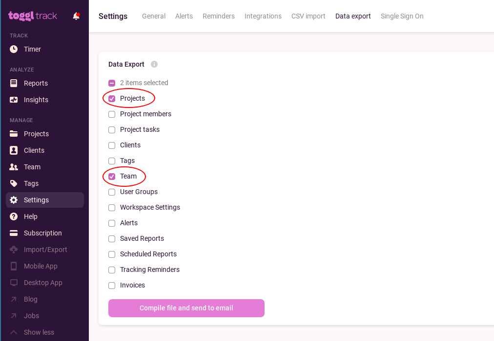

Inside this Zip archive, you should find files called `team.json` and
`projects.json`.

**Person ID**

Inside `team.json` you will find a list of each person in your team. The
crucial field to note is the `id`. We will be copy/pasting this ID into Runn.

```json5
/* team.json */
[
  {
    "id": 6911244,
    "email": "zimmy41@yahoo.com",
    "fullname": "Bob Dylan",
    /* ... */
  },
  {
    "id": 6910539,
    "email": "derek@gmail.com",
    "fullname": "Eric Clapton",
    /* ... */
  }
]
```

**Project ID**

Within `projects.json` you will find a list of all your Toggl projects. You can
identify each project from the `name` field and then copy/paste the `id` field.

```json5
/* projects.json */
[
  {
    "id": 170103135,
    "name": "Hidden Moon Base",
    "workspace_id": 5411215
    /* ... */
  },
  {
    "id": 170101834,
    "name": "iCar Website",
    "workspace_id": 5411215
    /* ... */
  },
  {
    "id": 170106163,
    "name": "Model Z User Interface",
    "workspace_id": 5411215
    /* ... */
  }
]
```


**Workspace ID**

Also within the `projects.json` file, take note of the `workspace_id` field --
we will need this later to get a report of all the time worked from Toggl.

### Creating External References in Runn

#### People

For each person in Toggl, open up the Person Details page in Runn. From here
you should click on the cog in the top-right corner and select **Edit Details**.

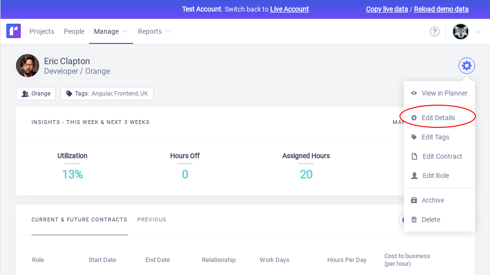

At the bottom of the form will be a link to **Show external references**. If you
click on the link you will see an option to **Add new reference**.

For the Name, select **Custom1**.

For the External ID, enter the matching ID from `team.json`.

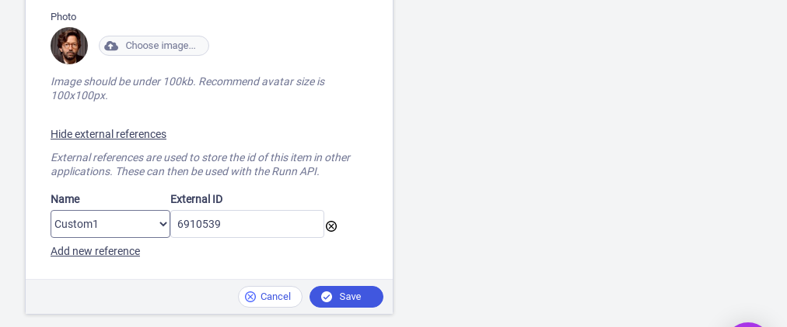

#### Projects

You will need to follow a similar process for each project. Visit the Project
Details page, click on the cog in the top-right corner and select **Edit
Details**.

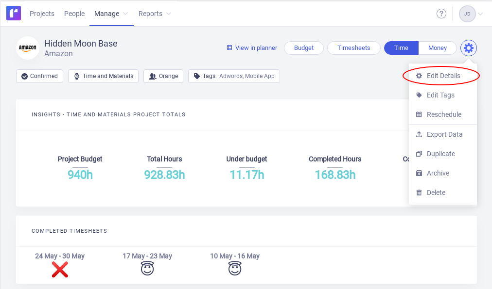

At the bottom of the form will be a link to **Show external references**. If you
click on the link you will see an option to **Add new reference**.

For the Name, select **Custom1**.

For the External ID, enter the matching ID from `projects.json`.

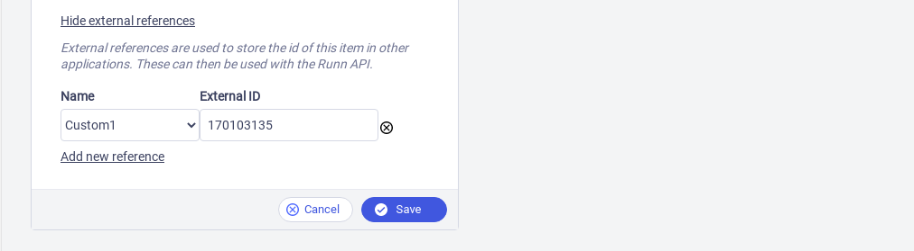

### Fetching API Keys

One more thing before we can start writing a script: you'll need to get your
API keys for both Runn and Toggl.

#### Runn API Key

**Use your test account**

Runn has a neat feature called the "Test Account", which allows you to safely
experiment on a copy of your Runn account.

You can switch to your test account by clicking on your profile in the
top-right corner, and selecting **Switch to test account**. Once there you can
click **Copy live data** to copy all the data from your live account into your
test account.

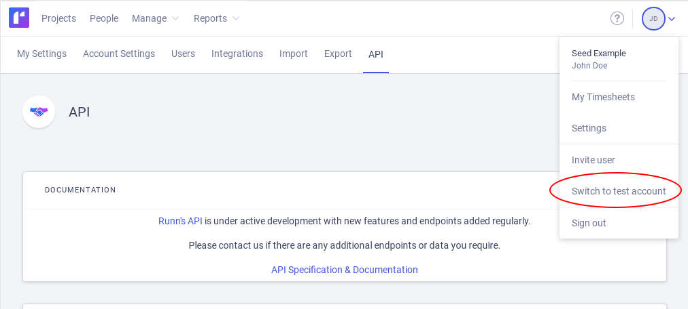

**Getting your Runn API Key**

Visit the **Settings** page and navigate to the **API** tab.

You should see your **API Token** displayed on the page. If you don't, simply
click the **Generate** button. You can tell the API key is for your test
account because it will start with `TEST_`.

If you want to use this script in production all you need to do is to switch
back to your live Runn account and copy the API key from the settings page. You
will know you are using a production API key if it starts with `LIVE_`.

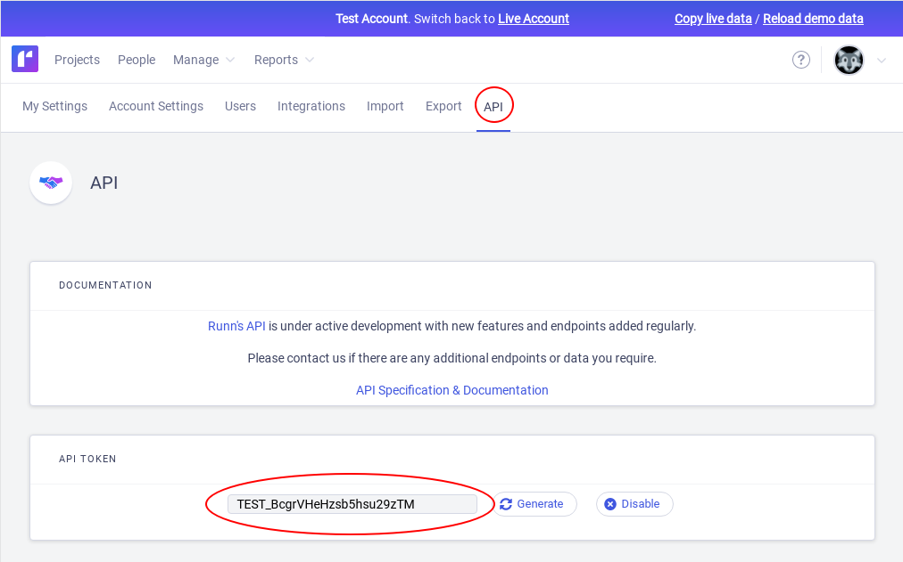

#### Toggl API Key

Open Toggl and click on your profile in the bottom right corner, then select
**Profile Settings**.

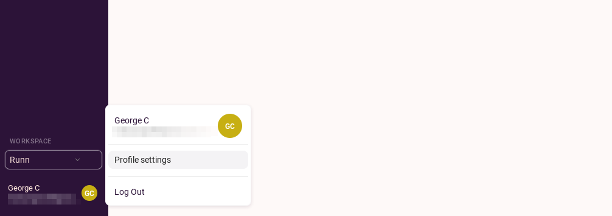

Scroll to the bottom of the page and look for the section labelled **API
Token**. Click the `-- Click to Reveal --` button to reveal your API key.

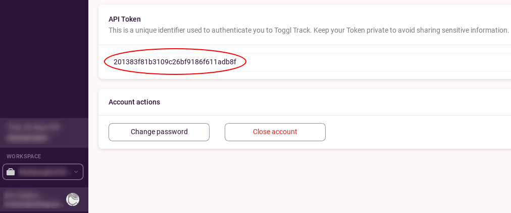

## Writing a Script

With your external references defined and your API keys in your clipboard, you
are now ready to start building a script.

We are going to be using Node.js. If you haven't already got Node.js installed
locally, you can download it from [https://nodejs.org](https://nodejs.org).

If you would like to skip straight to the final product, you can check out the
project at
[github.com/Runn-Fast/runn-api-tutorial](https://github.com/Runn-Fast/runn-api-tutorial/blob/main/toggl_timesheets/index.mjs)

### Installing Dependencies

To make using these HTTP API's easy, we will be using [the `got`
library](https://npmjs.com/package/got). 

```shell
$ npm install got
```

Now we can create an `index.mjs` file. Let's start by importing `got` and
pasting in our API keys.

```javascript
import got from 'got';

// Update the below variables with your own API keys.

const TOGGL_API_KEY = '201383f81b3109c26bf9186f611adb8f';

const RUNN_API_KEY = 'TEST_BcgrVHeHzsb5hsu29zTM';
```

### API Wrappers

The `got` library has a neat feature where we can easily customize it to make
it work with a particular API. 

Instead of having to supply the same config repeatedly for each request, we can
use `got.extend` to just define this once.

#### Runn API Configuration

Each API request to Runn will always start with `https://app.runn.io/api/`. To
simplify our API requests we can set this string as the `prefixUrl` so we don't
have to type it out each time.

The Runn API also requires that we pass our API key via the `Authorization`
header.

The Runn API also responds with data in the JSON format, so we can tell `got`
to parse the JSON for us. When we get a response we can access the data directly
within the `body` field.

```javascript
const runnAPI = got.extend({
  prefixUrl: 'https://app.runn.io/api/',
  headers: {
    Authorization: `Bearer ${RUNN_API_KEY}`
  },
  responseType: 'json'
});
```

#### Toggl API Configuration

We can do the same thing for the Toggl API.

Toggl authenticates with the username & password option.

```javascript
const togglAPI = got.extend({
  prefixUrl: 'https://api.track.toggl.com/',
  username: TOGGL_API_KEY,
  password: 'api_token',
  responseType: 'json'
});
```

### Getting a list of projects from Runn

We will need to get a list of all the projects from Runn.

We can use the `/v0/projects` endpoint for this.

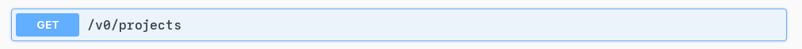

```javascript
const getProjectsFromRunn = async () => {
  const response = await runnAPI.get('v0/projects');
  return response.body;
};
```

The response body will look like this:

```json5
[
  {
    "id": "825hq53m",
    "name": "Hidden Moon Base",
    "archived": false,
    "references": {
      "Custom1": { "external_id": "170103135" }
    },
    "confirmed": true,
    "client_name": "Amazon",
    "client_id": "564c1k67",
    "team_id": "wpos8m9",
    "budget": "116400.0",
    "rate_card_id": "09ncxx9j",
    "pricing_model": "tm",
    "tags": [ "Adwords", "Important" ]
  },
  /* ... */
]
```

### Getting a list of people from Runn

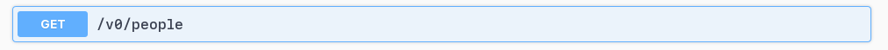

```javascript
const getPeopleFromRunn = async () => {
  const response = await runnAPI.get('v0/people');
  return response.body;
};
```

The response body will look like this:

```json5
[
  {
    "id": "3d1hd5zn",
    "name": "Eric Clapton",
    "archived": false,
    "references": {
      "Custom1": { "external_id": "6910539" }
    },
    "first_name": "Eric",
    "last_name": "Clapton",
    "email": "derek@gmail.com",
    "role_id": "029cn27v",
    "role": { /* ... */ },
    "team_id": "wpos8m9",
    "team": { /* ... */ },
    "current_contract_id": "ye0cg944",
    "current_contract": { /* ... */ },
    "projects": [ /* ... */ ],
    "tags": [ "Frontend", "React", "Indonesia" ],
    "is_placeholder": false
  },
  /* ... */
]
```

### Looking up a person or project by their external ID

Let's create a helper function to easily retrieve a person or project by its
external ID.

In Runn, external IDs are always kept as strings. In Toggl, IDs can also be
numbers so we will convert the provided ID to a string (if it's not already).

We can then use the `.find` method to loop through each item of the list and
return the first one that has a matching ID.

Note that we define a new constant, `RUNN_EXTERNAL_ID_KEY` -- this refers to
the key we used when assigning external IDs back in part 1 of this post.

```javascript
const RUNN_EXTERNAL_ID_KEY = 'Custom1';

const findItemByReference = (list, reference) => {
  const referenceString = String(reference);
  return list.find(item => {
    if (item.references[RUNN_EXTERNAL_ID_KEY]) {
      return item.references[RUNN_EXTERNAL_ID_KEY].external_id === referenceString;
    }

    return false;
  });
};
```

We can use this function like this:

```javascript
const people = await getPeopleFromRunn();
const person = findItemByExternalId(people, externalId);
```

### Getting a report of the projects worked on today in Toggl

The Toggl API has an endpoint for getting a weekly summary of all the projects
that have been worked on and by whom.

This endpoint can return data for a range of days, but in this example, we are
just going to look at the data for the current date.

This function expects the date to be in the form "YYYY-MM-DD".

Note, we also define two new constants here:

- `TOGGL_WORKSPACE_ID`: This is the `workspace_id` value you found in
the `projects.json` file.
- `YOUR_EMAIL_ADDRESS`: The Toggl API requires you to provide contact
information when accessing their API.

You can find more information about the Toggl Reports API at
[github.com/toggl/toggl_api_docs](https://github.com/toggl/toggl_api_docs/blob/master/reports.md).

```javascript
const TOGGL_WORKSPACE_ID = '5411215'
const YOUR_EMAIL_ADDRESS = 'your.email@example.com'

const getWeeklyReportFromToggl = async (date) => {
  const response = await togglAPI.get('reports/api/v2/weekly', {
    searchParams: {
      user_agent: YOUR_EMAIL_ADDRESS,
      workspace_id: TOGGL_WORKSPACE_ID,
      since: date,
      until: date,
    }
  })
  return response.body
}
```

The response body from Toggl will look like:

```json5
{
  "data": [
    {
      "title": {
        "client": "Apple",
        "project": "Hidden Moon Base",
        "color": "0",
        "hex_color": "#c7af14"
      },
      "pid": 170103135,
      "totals": [ 1385000, null, null, null, null, null, null, 1385000 ],
      "details": [
        {
          "uid": 6910539,
          "title": { "user": "Eric Clapton" },
          "totals": [ 1385000, null, null, null, null, null, null, 1385000 ]
        }
      ]
    },
    /* ... */
  ],
  "week_totals": [ 1391000, null, null, null, null, null, null, 1391000 ],
  "total_grand": 1391000,
  "total_billable": 1391000,
  "total_currencies": [ { "currency": "USD", "amount": 0 } ]
}
```

### Updating Actuals in Runn

The last API call we need is to update the "Actuals" data in Runn.

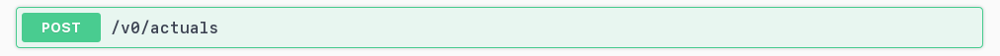

Arguments:

- `date`: which day to update
- `project_id`: the ID of the project
- `person_id`: the ID of the person
- `role_id`: the ID of the role
- `billable_minutes`: the whole number of minutes that were worked on the project

```javascript
const postActualTimeToRunn = async (options) => {
  const response = await runnAPI.post('v0/actuals', {
    json: {
      date: options.date
      project_id: options.projectId,
      person_id: options.personId,
      role_id: options.roleId,
      billable_minutes: options.billableMinutes,
    },
  })
  return response.body
}
```

### Putting it all together

With all these functions defined, we can now compose them together.

The process will work like this:

1. Fetch report data from Toggl
2. Fetch the list of projects from Runn
3. Fetch the list of people from Runn
4. Loop through each person in the Toggl report
5. Match the persons Toggl ID to a Runn person by their external reference
6. Match the projects Toggl ID to a Runn project by their external reference
8. Update the actuals in Runn for that person or project with the minutes worked

Toggl reports time in milliseconds, while Runn only uses whole minutes, so we
will need to switch units before sending the data to Runn.

```javascript
const main = async () => {
  // Get the current date in the form YYYY-MM-DD
  const isoDateString = new Date().toISOString().split('T')[0];

  const report = await getWeeklyReportFromToggl(isoDateString);

  const projects = await getProjectsFromRunn();
  const people = await getPeopleFromRunn();

  const promises = report.data.flatMap(item => {
    return item.details.map(person => {
      const runnPerson = findItemByReference(people, person.uid);
      if (!runnPerson) {
        console.log(`Could not find person "${person.title.user}" in Runn, looking for reference: "${RUNN_EXTERNAL_ID_KEY}=${person.uid}"`);
        return undefined;
      }

      const runnProject = findItemByReference(projects, item.pid);
      if (!runnProject) {
        console.log(`Could not find project "${item.title.project}" in Runn, looking for reference: "${RUNN_EXTERNAL_ID_KEY}=${item.pid}"`);
        return undefined;
      }

      // Convert from total time from milliseconds to minutes (must be a whole number)
      const billableMinutes = Math.round(person.totals[7] / 1000 / 60);

      console.log(`${runnProject.name}: ${runnPerson.name} (${runnPerson.role.name}) @ ${billableMinutes} minutes`);

      return postActualTimeToRunn({
        date: isoDateString,
        project_id: runnProject.id,
        person_id: runnPerson.id,
        role_id: runnPerson.role_id,
        billable_minutes: billableMinutes
      });
    });
  });

  await Promise.all(promises);
};

main()
```

### Running the syncing script

Now can execute the script.

Note, that it's safe to call the script multiple times, it will update each
person's timesheets and print the results to the console.

```shell
$ node index.mjs
Hidden Moon Base: Eric Clapton (Developer) @ 302 minutes
iCar Website: Bob Dylan (Designer) @ 128 minutes
Model Z User Interface: Alan Jackson (Project Manager) @ 281 minutes
```

You can confirm that the actuals have been copied across by viewing the Person
Details page and checking the **Timesheet** section. The **Actual** value for
the current day should match what's in Toggl.

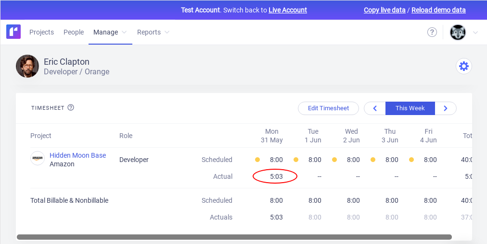

## Taking this further

This is quite a basic script, there are plenty of improvements that could be
made:

- sync data for the past week, instead of just today
- scheduling this script to run every hour
- handle network request failures
